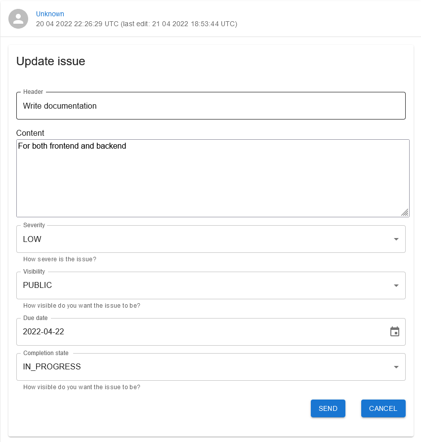

# Unknown's Issue Tracker

My own implementation of an issue tracker aimed mostly at my needs.

## Deployment

This project is deployed on [Vercel](https://nnpia-sem-pr-frontend.vercel.app/).

## Environment Variables

To run this project, you will need to add the following environment variables to your .env file

`REACT_APP_BASE_URI`

## Features

- Issue management
- Comment management
- User management
- Pagination
- Sorting of fetched issues

## Related

Link to backend repository

[Backend](https://github.com/Unkn0wn126/nnpia_sem_pr_backend)

## Acknowledgements

 - [Readme created with readme.so](https://readme.so)
 - [Material design look and feel](https://mui.com/)
 - [Form validation](https://formik.org/)

## Screenshots

Issue list example

Issue detail example

Issue edit example

Comment list example

Comment edit example

User list example

User detail example

User edit example